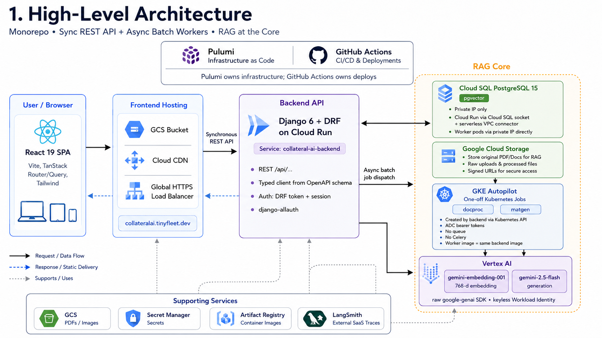
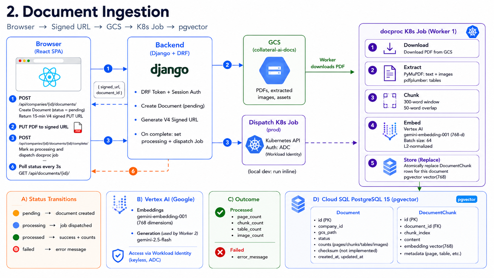
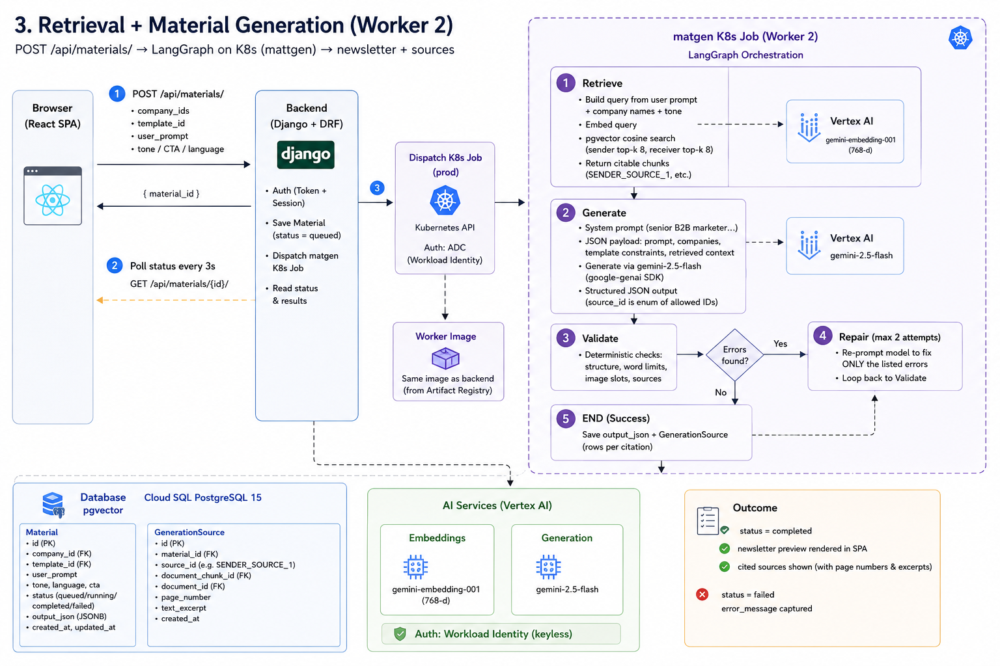
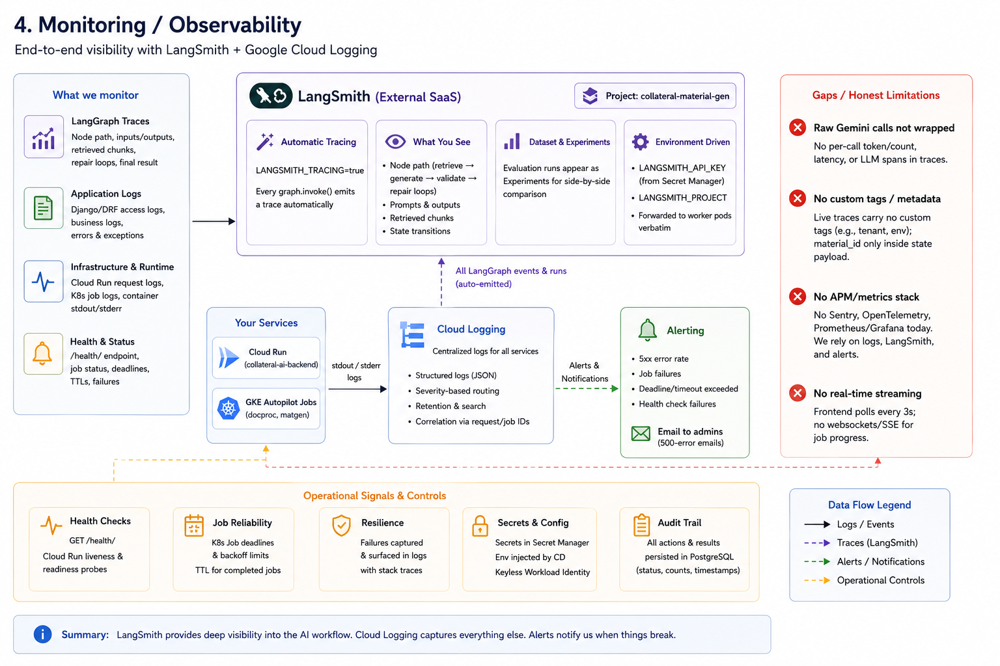
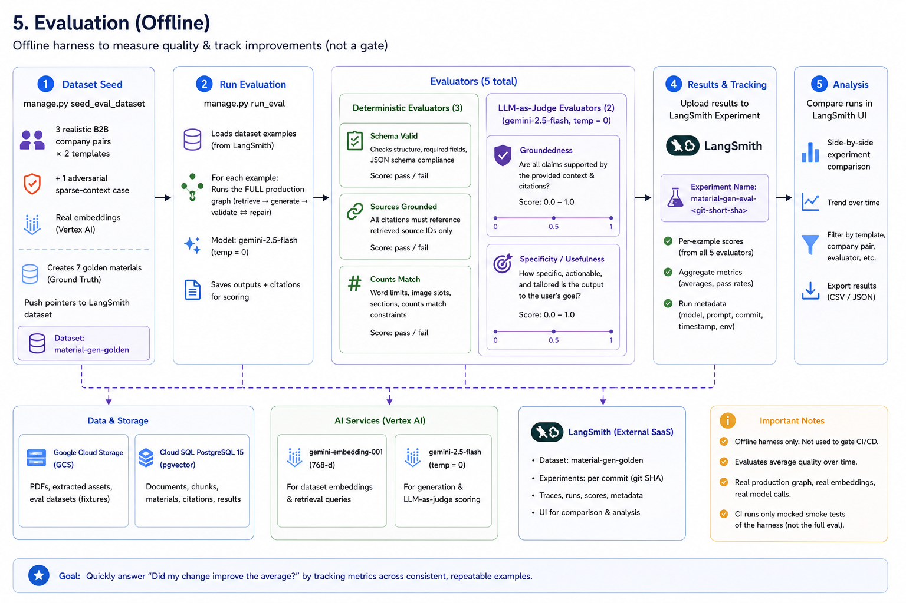
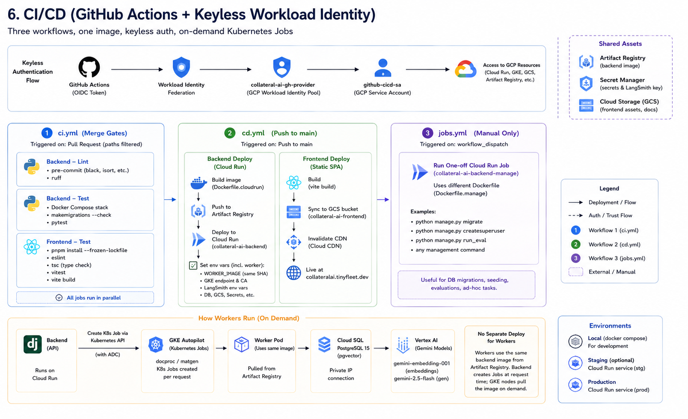

# Collateral AI

Generate on-brand sales and marketing collateral grounded in your own company documents.
Upload a company's documents, Collateral AI ingests and embeds them, and a LangGraph
pipeline generates validated materials from the retrieved context — with edit-and-regenerate
built in.

## Links

| | |
| --- | --- |
| **Live app** | https://collateralai.tinyfleet.dev |
| **Backend API** | https://collateral-ai-backend-qv2e2i67pa-uc.a.run.app — health check at [`/health/`](https://collateral-ai-backend-qv2e2i67pa-uc.a.run.app/health/); API under `/api/v1/` (Swagger UI is auth-gated in prod — use the [local docs](http://localhost:8000/api/docs/) instead) |
| **Django admin** | [prod](https://collateral-ai-backend-qv2e2i67pa-uc.a.run.app/admin/) · [local](http://localhost:8000/admin/) — create a login with `just createsuperuser` |
| **GitHub repo** | https://github.com/hashaaamm/collateral-ai |
| **CI/CD runs** | https://github.com/hashaaamm/collateral-ai/actions |
| **GCP console** | [`collateralai-501708`](https://console.cloud.google.com/home/dashboard?project=collateralai-501708) (app) · [`shared-infra-project-501613`](https://console.cloud.google.com/net-services/dns/zones?project=shared-infra-project-501613) (DNS zone for `tinyfleet.dev`) |
| **LangSmith** | [smith.langchain.com](https://smith.langchain.com) — tracing + eval experiments under project `collateral-material-gen` |

## How it works

1. **Companies & documents** — create a company profile and upload its documents. An async
   worker parses and chunks each document and embeds it with Vertex AI (768-dim) into
   Postgres + pgvector.
2. **Materials** — pick a template and generate. A LangGraph pipeline
   (retrieve → generate → validate ⇄ repair) produces the material, with runs traced in
   LangSmith. Materials can be edited and regenerated in a single action.
3. **Evals** — an offline eval harness (`seed_eval_dataset` / `run_eval` management commands)
   scores generation quality against a seeded dataset.

## Architecture

| Piece | Stack | Runs on |
| --- | --- | --- |
| [`frontend/`](frontend) | React 19 + Vite SPA — TanStack Router/Query, Tailwind CSS 4, typed API client generated from the backend's OpenAPI schema | GCS + Cloud CDN behind a global HTTPS load balancer (custom domain) |
| [`backend/`](backend) | Django + DRF under `/api/v1/`, drf-spectacular, allauth; Swagger UI at `/api/docs/` | Cloud Run |
| Async workers | Django management commands — `process_document` (ingestion) and `generate_material` (LangGraph + LangSmith) | Kubernetes Jobs on GKE Autopilot, created by the backend over the VPC connector |
| [`deploy/`](deploy) | Pulumi (Python) — Cloud Run, Cloud SQL Postgres (private IP, pgvector), GKE Autopilot worker cluster, Artifact Registry, Secret Manager, GCS/CDN hosting, Workload Identity Federation | GCP |
| [`.github/workflows/`](.github/workflows) | `ci.yml` (ruff lint, pytest, vitest — all merge gates), `cd.yml` (path-filtered deploys on push to `main`), `jobs.yml` (migrations / management commands against prod) | GitHub Actions |

All GCP infrastructure changes go through Pulumi in `deploy/` — never the console or ad-hoc
`gcloud`.

## Diagrams

Written walkthroughs for each diagram live in [docs/diagram-context.md](docs/diagram-context.md).

### High-level architecture



### Document ingestion



### Retrieval + material generation



### Monitoring & observability



### Evaluation



### CI/CD



## Repository layout

```
backend/     Django project (apps live in backend/collateral_ai/: companies, documents,
             materials, dashboard, users)
frontend/    React + Vite SPA
deploy/      Pulumi program (components/ per resource group)
scripts/     Operational helpers (GitHub secrets, local GCS emulator init)
justfile     Task runner — `just` to list commands
```

## Local development

Prerequisites: Docker and [`just`](https://github.com/casey/just) — see
[PREREQUISITES.md](PREREQUISITES.md) for the full list.

```bash
just up               # django + postgres + GCS emulator + frontend (Vite dev server)
just gcs-init         # one-time: create the emulator bucket + CORS
just migrate
just createsuperuser
```

- Frontend: http://localhost:3001
- API: http://localhost:8000 (Swagger UI at `/api/docs/`, schema at `/api/schema/`)

Everyday commands:

```bash
just test             # backend pytest
just lint             # pre-commit (ruff etc.) — required before pushing; CI blocks on it
just gen-api          # regenerate the typed frontend client after backend API changes
just manage <cmd>     # any manage.py command
```

Frontend unit tests run with `pnpm test` (vitest) in `frontend/`.

## Deployment

Push to `main` and GitHub Actions does the rest (auth via Workload Identity Federation — no
long-lived keys). Path filters decide what deploys: backend changes build and deploy to Cloud
Run; frontend changes build the SPA, sync it to the GCS bucket, and invalidate the CDN.
Database migrations run through the manual **Run Job** workflow.

First-time environment setup: work through [PREREQUISITES.md](PREREQUISITES.md), then
[SETUP-GUIDE.md](SETUP-GUIDE.md).

## More docs

- [AGENTS.md](AGENTS.md) — conventions for agents and contributors
- [SETUP-GUIDE.md](SETUP-GUIDE.md) — step-by-step runbook for the parts Pulumi can't do
- [PREREQUISITES.md](PREREQUISITES.md) — accounts, tools, and one-time setup
