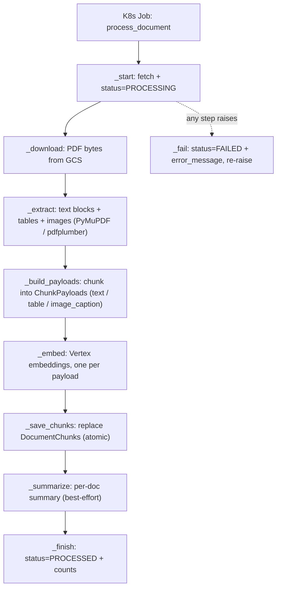
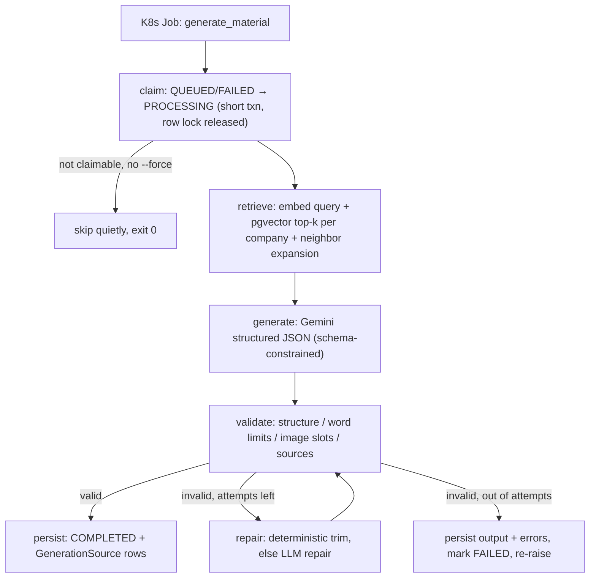

# Worker Readability Refactor Implementation Plan

> **For agentic workers:** REQUIRED SUB-SKILL: Use superpowers:subagent-driven-development (recommended) or superpowers:executing-plans to implement this plan task-by-task. Steps use checkbox (`- [ ]`) syntax for tracking.

**Goal:** Behavior-preserving readability refactor of the two K8s worker flows (document ingestion, material generation) so each flow reads top-to-bottom in one place — per the approved spec at `docs/superpowers/specs/2026-07-14-worker-readability-refactor-design.md`.

**Architecture:** Ingestion's `process()` becomes a named-step orchestrator with instrumentation pushed into step helpers and a frozen `ChunkPayload` dataclass replacing raw payload dicts. Generation's LangGraph module is rewritten as module-level named nodes taking an explicit `GenerationDeps`, state grouped via a frozen `RetrievedContext`, and the full `ValidationResult` carried in state so the service never re-validates. One new doc (`docs/workers-flow.md`) captures the flow diagrams and pattern vocabulary.

**Tech Stack:** Django 5 management commands, LangGraph (`StateGraph`), google-genai (Vertex, keyless ADC), pgvector, pytest (in Docker), ruff + pre-commit.

## Global Constraints

Copied from the spec — every task must preserve these:

- Same DB writes: statuses, `output_json`, `validation_result`, `retrieved_context`, `GenerationSource` rows, `DocumentChunk` rows — byte-identical shapes.
- Missing row → `Document.DoesNotExist` / `MarketingMaterial.DoesNotExist` → `CommandError` (raised in the command, not the service).
- Any pipeline failure → status `FAILED` + `error_message` + re-raise (non-zero exit).
- Generation claim-skip (status not QUEUED/FAILED, no `--force`) → `generate()` returns `False` → exit 0.
- Claim stays a short standalone `transaction.atomic()` block; the row lock is never held during generation.
- Document summary stays best-effort (failure → blank summary, ingestion continues).
- `review_status` never touched by the worker.
- The `langgraph` import stays lazy inside `build_generation_graph` (web pods must not pay it at startup). PLC0415 is per-file-ignored for `materials/generation/*` and `documents/processing/*` in `backend/pyproject.toml` — do not add noqa comments for lazy imports there.
- Untouched files: `chunking.py`, `embeddings.py`, `summarization.py`, `storage.py`, `extraction.py`, `validation.py`, `retrieval.py`, `expansion.py`, `prompts.py`, `model.py`, `schema.py`, both management commands, both `worker_trigger.py`, everything under `eval/`, `test_service.py`, `test_pipeline.py`.
- All commits from the repo root of this worktree. Commit messages end with `Co-Authored-By: Claude Fable 5 <noreply@anthropic.com>`.

### Running backend tests from this worktree

The local stack uses fixed container names (`collateral_ai_local_*`), so `docker compose run` from a worktree collides with the main checkout's running stack. Use the established worktree-override recipe (Task 1 Step 1 creates it). All pytest commands below run **from `backend/`** as:

```bash
docker compose -p wflow -f docker-compose.local.yml -f docker-compose.worktree.yml run --rm django pytest <args>
```

---

### Task 1: Ingestion pipeline — named steps + `ChunkPayload`

**Files:**
- Create: `backend/docker-compose.worktree.yml` (untracked test-infra shim, NOT committed)
- Modify: `backend/collateral_ai/documents/processing/pipeline.py` (full rewrite, same public API)
- Test: `backend/collateral_ai/documents/tests/processing/` (existing suite — no edits expected)

**Interfaces:**
- Consumes: existing sub-services (`StorageService.download`, `PdfExtractionService.extract`, `ChunkingService.chunk_text`, `EmbeddingService.embed_documents`, `DocumentSummaryService.summarize`) — unchanged.
- Produces: `DocumentProcessingService.process(document_id: int, *, force: bool = False) -> None` — signature unchanged (the command relies on it). New internal type `ChunkPayload(chunk_type: str, page_number: int, content: str, metadata: dict)` — internal only; nothing outside `pipeline.py` may import it.

- [ ] **Step 1: Create the worktree compose override (test infra)**

Write `backend/docker-compose.worktree.yml` (copy of the recipe used by the `matgenctx` worktree, with unique names):

```yaml
# Untracked worktree-local override: unique container names so this worktree's
# test runs don't collide with the main checkout's running stack.
# Usage: docker compose -p wflow -f docker-compose.local.yml -f docker-compose.worktree.yml run --rm django pytest
services:
  django:
    container_name: collateral_ai_wflow_django
    depends_on:
      - postgres
      - gcs
  postgres:
    container_name: collateral_ai_wflow_postgres
  gcs:
    image: fsouza/fake-gcs-server:latest
    container_name: collateral_ai_wflow_gcs
    command: -scheme http -public-host gcs:4443 -port 4443 -data /data
    volumes:
      - ./.gcs-emulator:/data
```

Keep it out of `git status` for every worktree (shared exclude file):

```bash
grep -qxF 'backend/docker-compose.worktree.yml' "$(git rev-parse --git-common-dir)/info/exclude" || echo 'backend/docker-compose.worktree.yml' >> "$(git rev-parse --git-common-dir)/info/exclude"
```

- [ ] **Step 2: Baseline — run the documents processing suite (must be green before touching code)**

From `backend/`:

```bash
docker compose -p wflow -f docker-compose.local.yml -f docker-compose.worktree.yml run --rm django pytest collateral_ai/documents/tests/processing -v
```

Expected: all tests pass (exit 0). If the baseline is red, STOP and report — do not refactor on a red baseline.

- [ ] **Step 3: Rewrite `pipeline.py`**

Replace the entire contents of `backend/collateral_ai/documents/processing/pipeline.py` with:

```python
"""Document processing orchestration: download → extract → chunk → embed → persist.

`process()` is the flow, readable top to bottom; each private step owns its own
work, logging, and timing. This service owns the Document status state machine
(PROCESSING → PROCESSED / FAILED); sub-services own one capability each.
"""

from __future__ import annotations

import logging
import time
from contextlib import contextmanager
from dataclasses import dataclass
from typing import TYPE_CHECKING
from typing import Any

from django.db import transaction
from django.utils import timezone

from collateral_ai.documents.models import Document
from collateral_ai.documents.models import DocumentChunk
from collateral_ai.documents.processing.chunking import ChunkingService
from collateral_ai.documents.processing.embeddings import EmbeddingService
from collateral_ai.documents.processing.extraction import PdfExtractionService
from collateral_ai.documents.processing.storage import StorageService
from collateral_ai.documents.processing.summarization import DocumentSummaryService
from collateral_ai.documents.statuses import DocumentStatus

if TYPE_CHECKING:
    from collections.abc import Iterator

    from collateral_ai.documents.processing.extraction import ExtractionResult

logger = logging.getLogger(__name__)


@contextmanager
def _timed(label: str) -> Iterator[None]:
    """Log `timing: <label> <seconds>` around a step (always, even on failure)."""
    t = time.monotonic()
    try:
        yield
    finally:
        logger.info("timing: %s %.2fs", label, time.monotonic() - t)


@dataclass(frozen=True)
class ChunkPayload:
    """One embeddable unit of a document: a text chunk, table chunk, or image caption."""

    chunk_type: str
    page_number: int
    content: str
    metadata: dict[str, Any]


class DocumentProcessingService:
    def __init__(self) -> None:
        self.storage = StorageService()
        self.extractor = PdfExtractionService(storage=self.storage)
        self.chunker = ChunkingService()
        self.embedder = EmbeddingService()
        self.summarizer = DocumentSummaryService()

    def process(self, document_id: int, *, force: bool = False) -> None:
        document = self._start(document_id)
        try:
            pdf_bytes = self._download(document)
            extraction = self._extract(document, pdf_bytes)
            payloads = self._build_payloads(document, extraction)
            embeddings = self._embed(payloads)
            self._save_chunks(document, payloads, embeddings)
            summary = self._summarize(document.id, payloads)
            self._finish(document, extraction, payloads, summary)
        except Exception as exc:
            self._fail(document, exc)
            raise

    def _start(self, document_id: int) -> Document:
        """Fetch + mark PROCESSING. DoesNotExist propagates (no FAILED write)."""
        t0 = time.monotonic()
        document = Document.objects.select_related("company").get(id=document_id)
        Document.objects.filter(id=document.id).update(
            status=DocumentStatus.PROCESSING,
            error_message="",
            updated_at=timezone.now(),
        )
        logger.info(
            "timing: db connect+fetch %.2fs (document=%s)",
            time.monotonic() - t0,
            document_id,
        )
        return document

    def _download(self, document: Document) -> bytes:
        t = time.monotonic()
        pdf_bytes = self.storage.download(document.storage_path)
        logger.info(
            "timing: gcs download %.2fs (%d bytes)",
            time.monotonic() - t,
            len(pdf_bytes),
        )
        return pdf_bytes

    def _extract(self, document: Document, pdf_bytes: bytes) -> ExtractionResult:
        t = time.monotonic()
        extraction = self.extractor.extract(pdf_bytes=pdf_bytes, document=document)
        logger.info(
            "timing: extraction %.2fs (pages=%d)",
            time.monotonic() - t,
            extraction.page_count,
        )
        return extraction

    def _build_payloads(
        self,
        document: Document,
        extraction: ExtractionResult,
    ) -> list[ChunkPayload]:
        base = {
            "document_id": str(document.id),
            "company_id": str(document.company_id),
            "embedding_model": self.embedder.model,
            "embedding_dimensions": self.embedder.dimensions,
            "chunking_version": self.chunker.version,
        }
        payloads = [
            *self._text_payloads(base, extraction),
            *self._table_payloads(base, extraction),
            *self._image_payloads(base, extraction),
        ]
        if not payloads:
            msg = "No extractable content found in PDF."
            raise ValueError(msg)
        return payloads

    def _text_payloads(
        self,
        base: dict[str, Any],
        extraction: ExtractionResult,
    ) -> list[ChunkPayload]:
        return [
            ChunkPayload(
                chunk_type="text",
                page_number=c["page_number"],
                content=c["content"],
                metadata={
                    **base,
                    "source": "pdf_text",
                    "chunk_index": c["chunk_index"],
                    "word_start": c["word_start"],
                    "word_end": c["word_end"],
                },
            )
            for block in extraction.text_blocks
            for c in self.chunker.chunk_text(block.text, block.page_number)
        ]

    def _table_payloads(
        self,
        base: dict[str, Any],
        extraction: ExtractionResult,
    ) -> list[ChunkPayload]:
        return [
            ChunkPayload(
                chunk_type="table",
                page_number=c["page_number"],
                content=c["content"],
                metadata={
                    **base,
                    "source": "pdf_table",
                    "chunk_index": c["chunk_index"],
                    "word_start": c["word_start"],
                    "word_end": c["word_end"],
                },
            )
            for table in extraction.tables
            for c in self.chunker.chunk_text(
                table.markdown,
                table.page_number,
                prefix="Extracted table",
            )
        ]

    def _image_payloads(
        self,
        base: dict[str, Any],
        extraction: ExtractionResult,
    ) -> list[ChunkPayload]:
        return [
            ChunkPayload(
                chunk_type="image_caption",
                page_number=image.page_number,
                content=image.caption,
                metadata={
                    **base,
                    "source": "pdf_image",
                    "chunk_index": i,
                    "image_storage_path": image.storage_path,
                },
            )
            for i, image in enumerate(extraction.images)
        ]

    def _embed(self, payloads: list[ChunkPayload]) -> list[list[float]]:
        t = time.monotonic()
        embeddings = self.embedder.embed_documents([p.content for p in payloads])
        logger.info(
            "timing: embeddings %.2fs (chunks=%d)",
            time.monotonic() - t,
            len(payloads),
        )
        if len(embeddings) != len(payloads):
            msg = f"embedding/chunk count mismatch {len(embeddings)}!={len(payloads)}"
            raise ValueError(msg)
        return embeddings

    def _save_chunks(
        self,
        document: Document,
        payloads: list[ChunkPayload],
        embeddings: list[list[float]],
    ) -> None:
        with _timed("save chunks"), transaction.atomic():
            DocumentChunk.objects.filter(document=document).delete()
            DocumentChunk.objects.bulk_create(
                [
                    DocumentChunk(
                        document=document,
                        company=document.company,
                        chunk_type=p.chunk_type,
                        page_number=p.page_number,
                        content=p.content,
                        embedding=e,
                        metadata=p.metadata,
                    )
                    for p, e in zip(payloads, embeddings, strict=True)
                ],
                batch_size=500,
            )

    def _summarize(self, document_id: int, payloads: list[ChunkPayload]) -> str:
        """Best-effort: a missing summary must never fail ingestion (spec §5.2)."""
        try:
            with _timed("summary"):
                return self.summarizer.summarize([p.content for p in payloads])
        except Exception:  # noqa: BLE001 — any summarizer error degrades to no summary
            logger.warning(
                "summary generation failed document=%s; continuing without one",
                document_id,
                exc_info=True,
            )
            return ""

    def _finish(
        self,
        document: Document,
        extraction: ExtractionResult,
        payloads: list[ChunkPayload],
        summary: str,
    ) -> None:
        Document.objects.filter(id=document.id).update(
            status=DocumentStatus.PROCESSED,
            summary=summary,
            page_count=extraction.page_count,
            chunks_count=len(payloads),
            tables_count=len(extraction.tables),
            images_count=len(extraction.images),
            error_message="",
            updated_at=timezone.now(),
        )

    def _fail(self, document: Document, exc: Exception) -> None:
        logger.exception("processing failed document=%s", document.id)
        Document.objects.filter(id=document.id).update(
            status=DocumentStatus.FAILED,
            error_message=str(exc),
            updated_at=timezone.now(),
        )
```

Behavior notes for the implementer (why this is byte-identical where it matters):
- `_start` raises `Document.DoesNotExist` *before* the `try`, so a missing row never writes `FAILED` — same as the old code, where the fetch happened before the `try`.
- The two `ValueError` guards moved verbatim into `_build_payloads` / `_embed`; they are still raised inside `process()`'s `try`, so failures still mark the document `FAILED`. The old `# noqa: TRY301` comments are gone because the raises no longer sit directly in the `try` block.
- `transaction.atomic` moved from decorator to context manager inside `_timed` so the commit is included in the timed span; the transactional scope is unchanged.
- `_summarize`'s catch-everything stays outside `_timed`, so a summarizer crash still logs the timing line (via `finally`) and degrades to `""`.
- `zip(..., strict=True)` is retained even though `_embed` already checks lengths — defense in depth, unchanged from the old code.

- [ ] **Step 4: Run the documents processing suite again**

From `backend/`:

```bash
docker compose -p wflow -f docker-compose.local.yml -f docker-compose.worktree.yml run --rm django pytest collateral_ai/documents/tests/processing -v
```

Expected: identical pass count to Step 2 (exit 0), zero test-file edits. `test_pipeline.py` asserts DB state only (statuses, chunk rows, metadata offsets, summary), so it must pass unchanged. If any test fails, fix `pipeline.py` — do NOT edit the tests.

- [ ] **Step 5: Lint the changed file**

From `backend/`:

```bash
pre-commit run --files collateral_ai/documents/processing/pipeline.py
```

Expected: all hooks pass (ruff clean — PLC0415 is per-file-ignored for this path; no TRY301 warnings remain).

- [ ] **Step 6: Commit**

From the repo root:

```bash
git add backend/collateral_ai/documents/processing/pipeline.py
git commit -m "refactor(documents): pipeline orchestrator reads as named steps

process() is now the 7-step story; timing moved into step helpers,
raw payload dicts replaced by a frozen ChunkPayload dataclass.
Behavior-preserving: same DB writes, same failure semantics.

Co-Authored-By: Claude Fable 5 <noreply@anthropic.com>"
```

Note: `backend/docker-compose.worktree.yml` stays untracked — never `git add` it.

---

### Task 2: Generation graph — named nodes, grouped state, single validation

**Files:**
- Modify: `backend/collateral_ai/materials/generation/graph.py` (full rewrite)
- Modify: `backend/collateral_ai/materials/generation/service.py` (imports, `_run_pipeline`, `_save_completed`, module docstring)
- Modify: `backend/collateral_ai/materials/tests/generation/test_graph.py` (mechanical state-key updates)
- Test: `backend/collateral_ai/materials/tests/generation/` (whole directory must stay green; `test_service.py` must pass WITHOUT edits)

**Interfaces:**
- Consumes: `OutputValidator.validate(...) -> ValidationResult` and `ValidationResult(is_valid, errors, to_dict())` from `validation.py`; `trim_to_word_limits(output, errors) -> dict | None` from `validation.py`; `build_retrieval_query` / payload builders from `prompts.py`; `RetrievalService.retrieve`, `fetch_document_summaries` from `retrieval.py`; `build_response_schema` from `schema.py` — all unchanged.
- Produces (used by service.py and test_graph.py in this same task):
  - `GenerationDeps(embedder, retriever, model, validator, max_repair_attempts: int)` — frozen dataclass.
  - `RetrievedContext(query_embedding, sender_chunks, receiver_chunks, sender_document_summaries, receiver_document_summaries, source_map, allowed_ids, response_schema, context_snapshot)` — frozen dataclass.
  - `build_generation_graph(deps: GenerationDeps)` — NEW signature (was five kwargs).
  - Final graph state keys: `output: dict`, `validation: ValidationResult`, `retrieval: RetrievedContext`, `attempts: int` (the old flat keys `is_valid`, `validation_errors`, `context_snapshot`, `source_map`, `allowed_ids`, `sender_chunks`, … are GONE).

- [ ] **Step 1: Baseline — run the materials generation suite (must be green)**

From `backend/`:

```bash
docker compose -p wflow -f docker-compose.local.yml -f docker-compose.worktree.yml run --rm django pytest collateral_ai/materials/tests/generation -v
```

Expected: all tests pass (exit 0).

- [ ] **Step 2: Rewrite `graph.py`**

Replace the entire contents of `backend/collateral_ai/materials/generation/graph.py` with:

```python
"""LangGraph pipeline for material generation: retrieve → generate → validate ⇄ repair.

Flow (edges wired in build_generation_graph):

    START → retrieve → generate → validate ──(valid, or out of attempts)──→ END
                                      │  ↑
                        (invalid, attempts left)
                                      ↓  │
                                     repair

Nodes are module-level functions taking (state, deps); build_generation_graph
binds deps and wires the edges. The service owns the DB state machine — this
module owns compute only and never touches the database rows.
"""

from __future__ import annotations

from dataclasses import dataclass
from functools import partial
from typing import Any
from typing import TypedDict

from django.conf import settings

from collateral_ai.materials.generation.prompts import REPAIR_SYSTEM_INSTRUCTION
from collateral_ai.materials.generation.prompts import SYSTEM_INSTRUCTION
from collateral_ai.materials.generation.prompts import build_generation_payload
from collateral_ai.materials.generation.prompts import build_repair_payload
from collateral_ai.materials.generation.prompts import build_retrieval_query
from collateral_ai.materials.generation.retrieval import fetch_document_summaries
from collateral_ai.materials.generation.schema import build_response_schema
from collateral_ai.materials.generation.validation import ValidationResult
from collateral_ai.materials.generation.validation import trim_to_word_limits
from collateral_ai.materials.statuses import SourceRole


@dataclass(frozen=True)
class GenerationDeps:
    """Everything the graph nodes need, injected by the service."""

    embedder: Any
    retriever: Any
    model: Any
    validator: Any
    max_repair_attempts: int


@dataclass(frozen=True)
class RetrievedContext:
    """Output of the retrieve node: grounding context + citation guardrails."""

    query_embedding: list[float]
    sender_chunks: list[Any]
    receiver_chunks: list[Any]
    sender_document_summaries: list[dict]
    receiver_document_summaries: list[dict]
    source_map: dict[str, Any]
    allowed_ids: set[str]
    response_schema: dict
    context_snapshot: dict


class GenerationState(TypedDict, total=False):
    material_id: int
    material: Any
    template: Any
    top_k: int
    retrieval: RetrievedContext
    output: dict
    validation: ValidationResult
    attempts: int


def _require_chunks(material, sender_chunks, receiver_chunks) -> None:
    for role, chunks, company in (
        ("sender", sender_chunks, material.sender_company),
        ("receiver", receiver_chunks, material.receiver_company),
    ):
        if not chunks:
            msg = (
                f"No processed document chunks for {role} company "
                f"{company.name!r} — upload and process documents first."
            )
            raise ValueError(msg)


def _document_summaries(sender_chunks, receiver_chunks) -> tuple[list, list]:
    if not settings.MATERIAL_INCLUDE_DOC_SUMMARIES:
        return [], []
    return (
        fetch_document_summaries(sender_chunks),
        fetch_document_summaries(receiver_chunks),
    )


def _stamp(output: dict, template, material) -> dict:
    output["template_id"] = template.slug
    output["theme"] = dict(template.theme)
    output["image_slots"] = [
        {"slot_id": slot["slot_id"], "source": slot["source"], "description": ""}
        for slot in template.image_slots
    ]
    if material.cta_link:
        output.setdefault("article", {})["cta_url"] = material.cta_link
    return output


def retrieve(state: GenerationState, deps: GenerationDeps) -> dict:
    material = state["material"]
    query_embedding = deps.embedder.embed_query(build_retrieval_query(material))
    sender_chunks = deps.retriever.retrieve(
        company_id=material.sender_company_id,
        query_embedding=query_embedding,
        source_role=SourceRole.SENDER,
        source_prefix="SENDER_SOURCE",
        top_k=state["top_k"],
    )
    receiver_chunks = deps.retriever.retrieve(
        company_id=material.receiver_company_id,
        query_embedding=query_embedding,
        source_role=SourceRole.RECEIVER,
        source_prefix="RECEIVER_SOURCE",
        top_k=state["top_k"],
    )
    _require_chunks(material, sender_chunks, receiver_chunks)
    sender_summaries, receiver_summaries = _document_summaries(
        sender_chunks,
        receiver_chunks,
    )
    source_map = {c.source_id: c for c in [*sender_chunks, *receiver_chunks]}
    allowed_ids = set(source_map)
    retrieval = RetrievedContext(
        query_embedding=query_embedding,
        sender_chunks=sender_chunks,
        receiver_chunks=receiver_chunks,
        sender_document_summaries=sender_summaries,
        receiver_document_summaries=receiver_summaries,
        source_map=source_map,
        allowed_ids=allowed_ids,
        response_schema=build_response_schema(
            constraints=state["template"].constraints,
            allowed_source_ids=sorted(allowed_ids),
        ),
        context_snapshot={
            "sender_context": [c.to_prompt_dict() for c in sender_chunks],
            "receiver_context": [c.to_prompt_dict() for c in receiver_chunks],
            "sender_document_summaries": sender_summaries,
            "receiver_document_summaries": receiver_summaries,
        },
    )
    return {"retrieval": retrieval}


def generate(state: GenerationState, deps: GenerationDeps) -> dict:
    retrieval = state["retrieval"]
    output = deps.model.generate_structured(
        system_instruction=SYSTEM_INSTRUCTION,
        user_input=build_generation_payload(
            material=state["material"],
            sender_chunks=retrieval.sender_chunks,
            receiver_chunks=retrieval.receiver_chunks,
            sender_document_summaries=retrieval.sender_document_summaries,
            receiver_document_summaries=retrieval.receiver_document_summaries,
        ),
        response_schema=retrieval.response_schema,
    )
    return {"output": _stamp(output, state["template"], state["material"])}


def validate(state: GenerationState, deps: GenerationDeps) -> dict:
    result = deps.validator.validate(
        output=state["output"],
        constraints=state["template"].constraints,
        image_slots=state["template"].image_slots,
        allowed_source_ids=state["retrieval"].allowed_ids,
    )
    return {"validation": result}


def repair(state: GenerationState, deps: GenerationDeps) -> dict:
    errors = state["validation"].errors
    trimmed = trim_to_word_limits(state["output"], errors)
    if trimmed is not None:
        return {"output": trimmed, "attempts": state["attempts"] + 1}
    retrieval = state["retrieval"]
    output = deps.model.generate_structured(
        system_instruction=REPAIR_SYSTEM_INSTRUCTION,
        user_input=build_repair_payload(
            output=state["output"],
            errors=errors,
            constraints=state["template"].constraints,
            image_slots=state["template"].image_slots,
            allowed_source_ids=sorted(retrieval.allowed_ids),
        ),
        response_schema=retrieval.response_schema,
    )
    return {
        "output": _stamp(output, state["template"], state["material"]),
        "attempts": state["attempts"] + 1,
    }


def route_after_validate(state: GenerationState, deps: GenerationDeps) -> str:
    if state["validation"].is_valid:
        return "done"
    if state["attempts"] >= deps.max_repair_attempts:
        return "done"
    return "repair"


def build_generation_graph(deps: GenerationDeps):
    # Lazy on purpose: web pods import this module (via service.py) but must
    # not pay the langgraph import at startup; only the worker builds the graph.
    from langgraph.graph import END
    from langgraph.graph import START
    from langgraph.graph import StateGraph

    builder = StateGraph(GenerationState)
    builder.add_node("retrieve", partial(retrieve, deps=deps))
    builder.add_node("generate", partial(generate, deps=deps))
    builder.add_node("validate", partial(validate, deps=deps))
    builder.add_node("repair", partial(repair, deps=deps))
    builder.add_edge(START, "retrieve")
    builder.add_edge("retrieve", "generate")
    builder.add_edge("generate", "validate")
    builder.add_conditional_edges(
        "validate",
        partial(route_after_validate, deps=deps),
        {"repair": "repair", "done": END},
    )
    builder.add_edge("repair", "validate")
    return builder.compile()
```

Behavior notes:
- `route_after_validate` now returns domain strings (`"done"` / `"repair"`); the mapping to `END` lives in the wiring where `END` is imported. Same routing behavior.
- `_stamp`, `_require_chunks`, `_document_summaries` are byte-identical to the old versions.
- `build_retrieval_query` and `trim_to_word_limits` are now top-level imports (no cycle: `prompts` and `validation` import nothing from `graph`).

- [ ] **Step 3: Update `service.py`**

Three edits to `backend/collateral_ai/materials/generation/service.py`:

Edit 1 — module docstring, add the ownership line. Replace:

```python
"""Worker 2 orchestration: claim → LangGraph pipeline → save.

State machine rules (spec §6.3): claim is its own short transaction so the row
lock is never held during the multi-minute pipeline; completed/processing
without --force skip with exit 0; review_status is never touched here.
"""
```

with:

```python
"""Worker 2 orchestration: claim → LangGraph pipeline → save.

Ownership split: this service owns the DB state machine (claim, COMPLETED /
FAILED writes); graph.py owns compute and never touches the database rows.

State machine rules (spec §6.3): claim is its own short transaction so the row
lock is never held during the multi-minute pipeline; completed/processing
without --force skip with exit 0; review_status is never touched here.
"""
```

Edit 2 — import `GenerationDeps` alongside the graph builder. Replace:

```python
from collateral_ai.materials.generation.graph import build_generation_graph
```

with:

```python
from collateral_ai.materials.generation.graph import GenerationDeps
from collateral_ai.materials.generation.graph import build_generation_graph
```

Edit 3 — replace the whole `_run_pipeline` and `_save_completed` methods (everything from `def _run_pipeline` to the end of the file) with:

```python
    def _run_pipeline(self, material: MarketingMaterial, *, top_k: int) -> None:
        deps = GenerationDeps(
            embedder=self.embedder,
            retriever=self.retriever,
            model=self.model,
            validator=self.validator,
            max_repair_attempts=self.max_repair_attempts,
        )
        final = build_generation_graph(deps).invoke(
            {
                "material_id": material.pk,
                "material": material,
                "template": material.template,
                "top_k": top_k,
                "attempts": 0,
            },
        )
        output = final["output"]
        result = final["validation"]
        retrieval = final["retrieval"]
        if not result.is_valid:
            MarketingMaterial.objects.filter(pk=material.pk).update(
                output_json=output,
                validation_result=result.to_dict(),
                retrieved_context=retrieval.context_snapshot,
                updated_at=timezone.now(),
            )
            msg = f"Generated output failed validation: {result.errors}"
            raise ValueError(msg)
        self._save_completed(material, output, result, retrieval)

    @transaction.atomic
    def _save_completed(self, material, output: dict, result, retrieval) -> None:
        now = timezone.now()
        MarketingMaterial.objects.filter(pk=material.pk).update(
            generation_status=GenerationStatus.COMPLETED,
            output_json=output,
            validation_result=result.to_dict(),
            retrieved_context=retrieval.context_snapshot,
            error_message="",
            completed_at=now,
            updated_at=now,
        )
        GenerationSource.objects.filter(material=material).delete()
        # Source validation guarantees every cited id maps to a retrieved chunk.
        rows = []
        for ref in output["source_references"]:
            src = retrieval.source_map[ref["source_id"]]
            rows.append(
                GenerationSource(
                    material=material,
                    company_id=src.company_id,
                    document_id=src.document_id,
                    chunk_id=src.chunk_id,
                    source_role=src.source_role,
                    page_number=src.page_number,
                    snippet=src.content[:500],
                    used_fact=ref["used_fact"][:1000],
                    relevance_score=src.relevance_score,
                ),
            )
        GenerationSource.objects.bulk_create(rows)
```

Also delete the now-unused import if flagged by ruff: `from collateral_ai.materials.generation.validation import OutputValidator` must STAY (the constructor still builds `OutputValidator()`); no import becomes unused in this edit — verify with ruff in Step 6.

Behavior notes:
- Failure branch: `result.to_dict()` produces exactly `{"is_valid": False, "errors": [...]}` — the same dict the old code built by hand. The `ValueError` message interpolates the same errors list (`result.errors` is the same object the old `final["validation_errors"]` held).
- Success branch: the old second `validator.validate(...)` call is gone; `final["validation"]` is the result of the graph's last validate pass over exactly the same output/constraints/slots/allowed ids, and the validator is deterministic — persisted `validation_result` JSON is byte-identical.

- [ ] **Step 4: Mechanically update `test_graph.py`**

Four edits to `backend/collateral_ai/materials/tests/generation/test_graph.py`:

Edit 1 — import `GenerationDeps`. Replace:

```python
from collateral_ai.materials.generation.graph import build_generation_graph
```

with:

```python
from collateral_ai.materials.generation.graph import GenerationDeps
from collateral_ai.materials.generation.graph import build_generation_graph
```

Edit 2 — rewrite the `_graph` helper (currently near the bottom, above `test_graph_passes_document_summaries_to_generation`). Replace:

```python
def _graph(embedder, retriever, model, validator):
    return build_generation_graph(
        embedder=embedder,
        retriever=retriever,
        model=model,
        validator=validator,
        max_repair_attempts=2,
    )
```

with:

```python
def _graph(embedder, retriever, model, validator, max_repair_attempts=2):
    return build_generation_graph(
        GenerationDeps(
            embedder=embedder,
            retriever=retriever,
            model=model,
            validator=validator,
            max_repair_attempts=max_repair_attempts,
        ),
    )
```

Edit 3 — replace all five direct call sites (in `test_graph_repairs_once_then_succeeds`, `test_graph_repairs_inline_citation_token_then_succeeds`, `test_graph_fails_after_max_attempts`, `test_graph_stamps_image_slots_from_template_no_slots`, `test_graph_stamps_image_slots_from_template_with_slots`). Each occurrence of:

```python
    graph = build_generation_graph(
        embedder=embedder,
        retriever=retriever,
        model=model,
        validator=validator,
        max_repair_attempts=2,
    )
```

becomes:

```python
    graph = _graph(embedder, retriever, model, validator)
```

(Definition order doesn't matter — `_graph` is resolved at call time inside the test functions.)

Edit 4 — update state-key assertions:

| Old | New | Occurrences |
|---|---|---|
| `final["is_valid"] is True` | `final["validation"].is_valid is True` | 3 (repairs_once, inline_citation, word_limit tests) |
| `final["is_valid"] is False` | `final["validation"].is_valid is False` | 1 (fails_after_max_attempts) |
| `final["context_snapshot"]["sender_document_summaries"]` | `final["retrieval"].context_snapshot["sender_document_summaries"]` | 1 (passes_document_summaries test) |

`final["attempts"]` and `final["output"]` assertions are unchanged (those keys survive).

- [ ] **Step 5: Run the materials generation suite**

From `backend/`:

```bash
docker compose -p wflow -f docker-compose.local.yml -f docker-compose.worktree.yml run --rm django pytest collateral_ai/materials/tests/generation -v
```

Expected: identical pass count to Step 1 (exit 0). `test_service.py` must pass with ZERO edits — it exercises the service through its public API and proves the facade held. If `test_service.py` fails, the bug is in `service.py`/`graph.py`, not the test.

- [ ] **Step 6: Lint the changed files**

From `backend/`:

```bash
pre-commit run --files collateral_ai/materials/generation/graph.py collateral_ai/materials/generation/service.py collateral_ai/materials/tests/generation/test_graph.py
```

Expected: all hooks pass.

- [ ] **Step 7: Commit**

From the repo root:

```bash
git add backend/collateral_ai/materials/generation/graph.py backend/collateral_ai/materials/generation/service.py backend/collateral_ai/materials/tests/generation/test_graph.py
git commit -m "refactor(materials): named graph nodes + single validation pass

graph.py reads state → nodes → routing → wiring: module-level node
functions take an explicit GenerationDeps; retrieval outputs grouped
into one frozen RetrievedContext (state 17 → 8 keys); the full
ValidationResult rides in state so the service reuses it instead of
re-validating. Behavior-preserving: identical persisted JSON.

Co-Authored-By: Claude Fable 5 <noreply@anthropic.com>"
```

---

### Task 3: Interview cheat sheet — `docs/workers-flow.md`

**Files:**
- Create: `docs/workers-flow.md`

**Interfaces:**
- Consumes: nothing (documentation of Task 1/2 results).
- Produces: nothing consumed by code — but the diagrams' step names MUST match the method/node names shipped in Tasks 1–2 (`_start`, `_download`, …; `retrieve`, `generate`, `validate`, `repair`).

- [ ] **Step 1: Write the doc**

Create `docs/workers-flow.md` with exactly this content:

````markdown
# Worker flows: ingestion & material generation

Both workers are Kubernetes Jobs (GKE Autopilot) that run one Django management
command for one row, then exit. The layering is the same in both:

> **command = process boundary · service = DB state machine · pipeline/graph =
> compute flow · sub-services = one capability each**

## Design patterns in play

- **Facade** — `DocumentProcessingService.process()` and
  `MaterialGenerationService.generate()` are the single entry points hiding each
  multi-class subsystem; every caller (K8s command, eval harness) goes through
  them. Precisely: application services acting as facades — they also own
  transactions and status transitions.
- **Pipeline** — ingestion is a linear step pipeline (an orchestrator method of
  named steps); generation's pipeline is declared as LangGraph edges.
- **State machine** — DB statuses (`DocumentStatus`, `GenerationStatus`) owned by
  the services, plus LangGraph's conditional edge (validate → repair / END) for
  the in-memory repair loop.
- **Dependency injection** — the generation service takes optional
  embedder/retriever/model overrides; graph nodes receive an explicit
  `GenerationDeps` instead of closing over variables.
- **Strategy (seam)** — `GenerationModel.generate_structured` is
  provider-swappable behind one interface (`vertex` today; the raw google-genai
  client is a deliberate grounding-quality choice).

Deliberately absent: inheritance-based Template Method and a generic Step
framework — plain composition keeps the indirection low.

## Ingestion — `manage.py process_document --document-id N`

Code: `backend/collateral_ai/documents/processing/pipeline.py`
(`DocumentProcessingService.process()` is the flow).



## Generation — `manage.py generate_material --material-id N`

Code: `backend/collateral_ai/materials/generation/service.py` (claim + persist)
and `graph.py` (compute).



## Failure & exit semantics

| Situation | Worker behavior | Exit code | K8s effect |
|---|---|---|---|
| Row not found | `CommandError` from the command | non-zero | retry per Job `backoffLimit`, then Failed |
| Ingestion step raises | Document → `FAILED` + `error_message`, re-raise | non-zero | retry per `backoffLimit` |
| Generation pipeline raises | Material → `FAILED` + `error_message`, re-raise | non-zero | retry per `backoffLimit` |
| Generation claim skip (already processing/completed, no `--force`) | log + return | 0 | Job Succeeded — duplicate executions are harmless |
| Output still invalid after max repairs | output + errors persisted, `FAILED`, re-raise | non-zero | retry per `backoffLimit` |
| Summary LLM failure during ingestion | warning, blank summary, continue | 0 | none — summaries are best-effort |
````

- [ ] **Step 2: Sanity-check the diagram names against the shipped code**

```bash
grep -n "_start\|_download\|_extract\|_build_payloads\|_embed\|_save_chunks\|_summarize\|_finish\|_fail" backend/collateral_ai/documents/processing/pipeline.py | head -12
grep -n "^def retrieve\|^def generate\|^def validate\|^def repair\|^def route_after_validate" backend/collateral_ai/materials/generation/graph.py
```

Expected: every name referenced in the doc exists in the code.

- [ ] **Step 3: Commit**

From the repo root (plain `git add` — `docs/workers-flow.md` is NOT under the gitignored `docs/superpowers/`):

```bash
git add docs/workers-flow.md
git commit -m "docs: workers flow walkthrough (ingestion + generation)

Co-Authored-By: Claude Fable 5 <noreply@anthropic.com>"
```

---

### Task 4: Full verification sweep

**Files:**
- No new files. Fix-forward only if something fails.

**Interfaces:**
- Consumes: everything above.
- Produces: a green full suite + clean lint as the merge gate.

- [ ] **Step 1: Run the ENTIRE backend suite**

From `backend/`:

```bash
docker compose -p wflow -f docker-compose.local.yml -f docker-compose.worktree.yml run --rm django pytest
```

Expected: exit 0, no failures anywhere (catches consumers outside the two suites, e.g. `test_run_eval.py`, API tests).

- [ ] **Step 2: Run the full lint gate**

From `backend/`:

```bash
pre-commit run --all-files
```

Expected: all hooks pass (this is the CI `backend-lint` gate).

- [ ] **Step 3: Invariant spot-check (grep audit)**

```bash
# The old flat state keys must be gone everywhere:
grep -rn "validation_errors\|context_snapshot\"\]\|\[\"is_valid\"\]" backend/collateral_ai/materials/generation/ backend/collateral_ai/materials/tests/generation/test_graph.py
# review_status must not appear in worker code:
grep -rn "review_status" backend/collateral_ai/materials/generation/
```

Expected: first grep only matches `context_snapshot` as a `RetrievedContext` field/attribute (no dict-style `final["context_snapshot"]` access anywhere); second grep returns nothing.

- [ ] **Step 4: Commit any stragglers**

If Steps 1–3 forced fixes, commit them:

```bash
git add -A backend/collateral_ai
git commit -m "test: fixups from full-suite verification

Co-Authored-By: Claude Fable 5 <noreply@anthropic.com>"
```

If nothing changed, skip this commit.

---

## Plan self-review (done at authoring time)

- **Spec coverage:** pipeline named steps + `_timed` + `ChunkPayload` (Task 1) ✓; graph named nodes + `GenerationDeps` + `RetrievedContext` + single validation + lazy langgraph kept (Task 2) ✓; service docstring + `GenerationDeps` + `_save_completed` binding (Task 2) ✓; `docs/workers-flow.md` with diagrams, patterns, semantics table (Task 3) ✓; untouched-files list respected — no task edits them ✓; tests-as-safety-net + mechanical-only test updates (Tasks 1/2/4) ✓.
- **Placeholders:** none — every code step shows complete code; every command has expected output.
- **Type consistency:** `ChunkPayload(chunk_type, page_number, content, metadata)` matches every use in `_save_chunks`/`_embed`/`_summarize`; `GenerationDeps` five fields match service construction and test helper; `RetrievedContext` nine fields match `retrieve()` construction and every `.sender_chunks`/`.allowed_ids`/`.response_schema`/`.source_map`/`.context_snapshot` access in `generate`/`validate`/`repair`/`service`/tests; `build_generation_graph(deps)` signature consistent across graph, service, and test helper.
