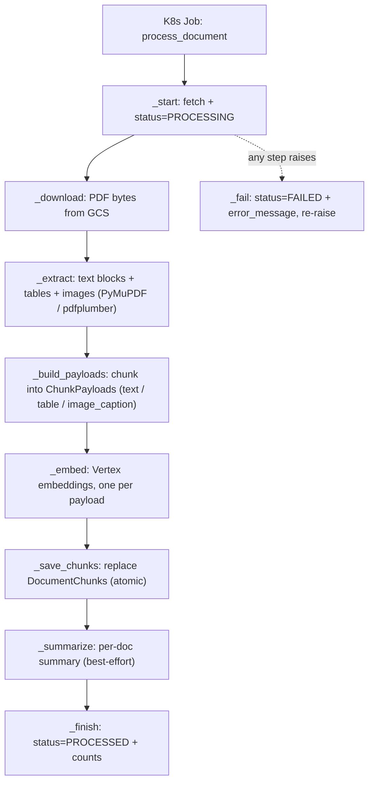
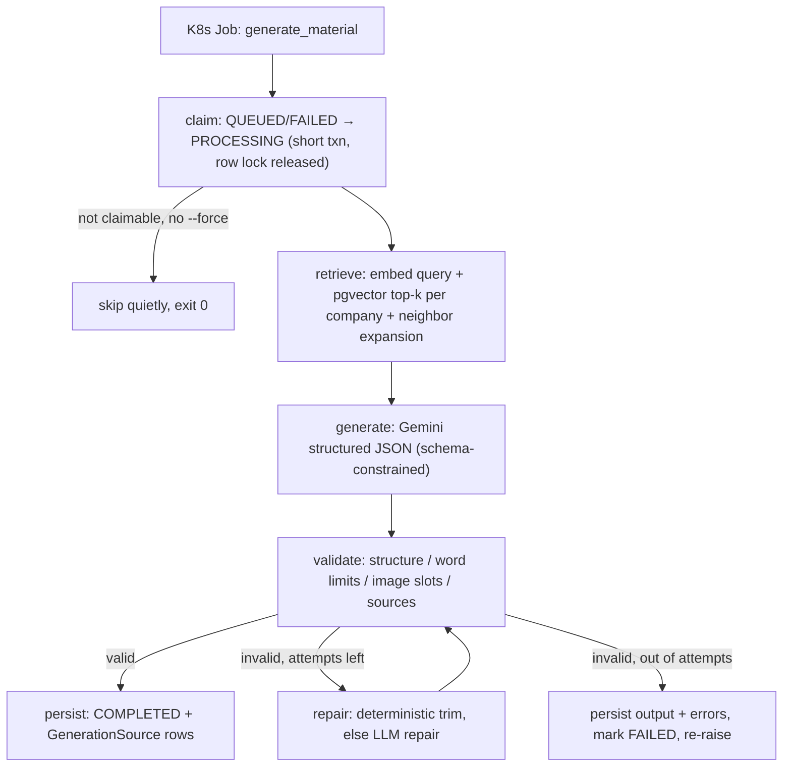

# Worker flows: ingestion & material generation

Both workers are Kubernetes Jobs (GKE Autopilot) that run one Django management
command for one row, then exit. The layering is the same in both:

> **command = process boundary · service = DB state machine · pipeline/graph =
> compute flow · sub-services = one capability each**

## Design patterns in play

- **Facade** — `DocumentProcessingService.process()` and
  `MaterialGenerationService.generate()` are the single entry points hiding each
  multi-class subsystem; every caller (K8s command, eval harness) goes through
  them. Precisely: application services acting as facades — they also own
  transactions and status transitions.
- **Pipeline** — ingestion is a linear step pipeline (an orchestrator method of
  named steps); generation's pipeline is declared as LangGraph edges.
- **State machine** — DB statuses (`DocumentStatus`, `GenerationStatus`) owned by
  the services, plus LangGraph's conditional edge (validate → repair / END) for
  the in-memory repair loop.
- **Dependency injection** — the generation service takes optional
  embedder/retriever/model overrides; graph nodes receive an explicit
  `GenerationDeps` instead of closing over variables.
- **Strategy (seam)** — `GenerationModel.generate_structured` is
  provider-swappable behind one interface (`vertex` today; the raw google-genai
  client is a deliberate grounding-quality choice).

Deliberately absent: inheritance-based Template Method and a generic Step
framework — plain composition keeps the indirection low.

## Ingestion — `manage.py process_document --document-id N`

Code: `backend/collateral_ai/documents/processing/pipeline.py`
(`DocumentProcessingService.process()` is the flow).

## Generation — `manage.py generate_material --material-id N`

Code: `backend/collateral_ai/materials/generation/service.py` (claim + persist)
and `graph.py` (compute).

## Failure & exit semantics

| Situation | Worker behavior | Exit code | K8s effect |
|---|---|---|---|
| Row not found | `CommandError` from the command | non-zero | retry per Job `backoffLimit`, then Failed |
| Ingestion step raises | Document → `FAILED` + `error_message`, re-raise | non-zero | retry per `backoffLimit` |
| Generation pipeline raises | Material → `FAILED` + `error_message`, re-raise | non-zero | retry per `backoffLimit` |
| Generation claim skip (already processing/completed, no `--force`) | log + return | 0 | Job Succeeded — duplicate executions are harmless |
| Output still invalid after max repairs | output + errors persisted, `FAILED`, re-raise | non-zero | retry per `backoffLimit` |
| Summary LLM failure during ingestion | warning, blank summary, continue | 0 | none — summaries are best-effort |
